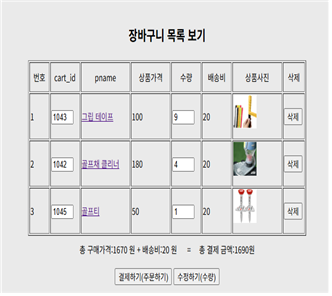

# 🛒 Spring 기반 쇼핑몰 장바구니 시스템

Spring Framework와 MyBatis를 활용하여 구현한 웹 쇼핑몰 장바구니 프로젝트입니다.  
카카오페이 API 연동을 통해 실 결제 기능도 구현하였습니다.

---

## 🔧 개발 환경
- **Java 버전**: Java 11 (JDK 11)
- **프레임워크**: Spring Framework 5.3.9
- **ORM/DB 매퍼**: MyBatis 3.3.1 + MyBatis-Spring 1.2.4
- **DB**: Oracle 21C
- **빌드 도구**: Maven (compiler-plugin 2.5.1, eclipse-plugin 2.9)
- **기타 라이브러리**: Lombok, JSTL, AspectJ, SLF4J, Log4j

---

## ✨ 주요 기능
- 상품 등록 / 수정 / 삭제 / 조회 (CRUD)
- 장바구니에 상품 추가, 수량 변경, 삭제
- 결제 금액 자동 계산 및 카카오페이 연동
- 주문 내역 조회 및 상세 보기 기능
- 관리자와 사용자 화면 분리

---

## 📷 실행 예시

<h3>📸 실행 예시</h3>

<table>
  <tr>
    <th>상품 목록 화면</th>
    <th>장바구니 화면</th>
    <th>결제 화면</th>
  </tr>
  <tr>
    <td></td>
    <td></td>
    <td></td>
  </tr>
</table>

> `docs/screenshots/` 폴더에 이미지를 업로드하여 반영하세요.

---

## 📁 프로젝트 구조

\`\`\`
src/
├── main/
│   ├── java/
│   │   └── com/maju/biz/
│   ├── resources/
│   │   ├── applicationContext.xml
│   │   └── sql-map-config.xml
│   └── webapp/
│       └── WEB-INF/views/
├── test/
└── pom.xml
\`\`\`

---

## ✅ 실행 방법
1. Oracle DB 실행 및 테이블 구성 (SQL 스크립트 참고)
2. STS(Spring Tool Suite) 또는 Eclipse에서 Import
3. pom.xml 동기화 및 applicationContext.xml 확인
4. 서버 실행 후 `localhost:8888/` 접속

---

## 🙋‍♂️ 개발자
- **이름**: 김동건  
- **이메일**: [okyes24@naver.com](mailto:okyes24@naver.com)  
- **개발 기간**: 2025.04.29 ~ 2025.05.13

---
